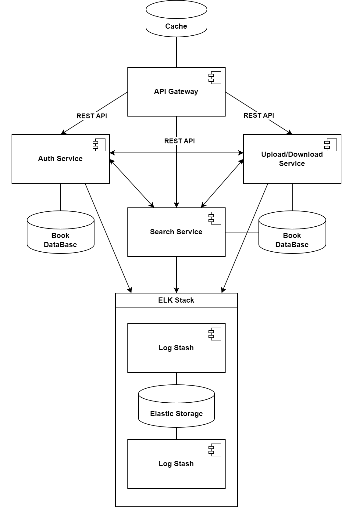

# Distributed Systems Programming Lab no. 2

### University: _Technical University of Moldova_
### Faculty: _Computers, Informatics and Microelectronics_
### Department: _Software Engineering and Automatics_
### Author: _Răzvan Fișer_

----

## Abstract
&ensp;&ensp;&ensp; This repository contains the laboratory work tasks on the PAD subject at TUM.

## System Architecture


## Postman collection

```json
{
	"info": {
		"_postman_id": "8b3582dd-d35d-4568-b1a6-6e6d0a55625b",
		"name": "Gateway",
		"schema": "https://schema.getpostman.com/json/collection/v2.1.0/collection.json",
		"_exporter_id": "27577776"
	},
	"item": [
		{
			"name": "Index",
			"request": {
				"method": "GET",
				"header": []
			},
			"response": []
		},
		{
			"name": "Get All Books",
			"request": {
				"method": "GET",
				"header": []
			},
			"response": []
		},
		{
			"name": "Get All Authors",
			"request": {
				"method": "GET",
				"header": []
			},
			"response": []
		},
		{
			"name": "Get Book by Id",
			"request": {
				"method": "GET",
				"header": []
			},
			"response": []
		},
		{
			"name": "Search by Title/Author",
			"request": {
				"method": "GET",
				"header": []
			},
			"response": []
		},
		{
			"name": "Download Book by ID",
			"request": {
				"method": "GET",
				"header": []
			},
			"response": []
		},
		{
			"name": "Upload Book",
			"request": {
				"method": "POST",
				"header": [
					{
						"key": "title",
						"value": "The Goyim Know",
						"type": "text"
					},
					{
						"key": "author_first_name",
						"value": "Razvan",
						"type": "text"
					},
					{
						"key": "author_surname",
						"value": "Fischer",
						"type": "text"
					},
					{
						"key": "year",
						"value": "2023",
						"type": "text"
					},
					{
						"key": "genre",
						"value": "Politics",
						"type": "text"
					}
				],
				"body": {
					"mode": "formdata",
					"formdata": [
						{
							"key": "pdf-file",
							"type": "file",
							"src": "/C:/Users/razva/Downloads/09073089.pdf",
							"disabled": true
						},
						{
							"key": "username",
							"value": "user1",
							"type": "text"
						},
						{
							"key": "password",
							"value": "password1",
							"type": "text"
						}
					]
				},
				"url": {
					"raw": "localhost:5001/upload",
					"host": [
						"localhost"
					],
					"port": "5001",
					"path": [
						"upload"
					]
				}
			},
			"response": []
		},
		{
			"name": "Log In",
			"request": {
				"method": "GET",
				"header": []
			},
			"response": []
		}
	]
}
```

## Endpoints documentation

The endpoints will be described in the order they are expected to be called.

User Service first as we need a Bearer Token for the endpoints in other services.
Track Service is expected second as we need tracks to efficiently use Playback Service.

With that being said, all the endpoints will work as expected, no matter the order.

### Auth Service Endpoints:

#### 1. Log In
- **Endpoint**: `POST /login`
- **Description**: Logs in in with provided credentials.
- **Parameters**: None
- **Body**: JSON with `username` and `password`

#### 2. Check if User Logged In
- **Endpoint**: `GET /check_user_logged_in`
- **Description**: Checks wether user is currently logged in.
- **Parameters**: None
- **Body**: None
- **Headers**: `Cookie` with session token. 

#### 3. Log Out
- **Endpoint**: `GET /logout`
- **Description**: Logs current user out.
- **Parameters**: None
- **Body**: None
- **Headers**: `Cookie` with session token. 

### Search Service:
#### 1. Get All Books
- **Endpoint**: `GET /books`
- **Description**: Retrieves all books.
- **Parameters**: None
- **Body**: None

#### 2. Get All Authors
- **Endpoint**: `GET /authors`
- **Description**: Fetches all authors.
- **Parameters**: None
- **Body**: None

#### 3. Get Book by Id
- **Endpoint**: `GET /books/id/{id}`
- **Description**: Fetches all authors.
- **Parameters**: `id` - the book id.
- **Body**: None

#### 4. Search Book by Title/Author
- **Endpoint**: `GET /search?title={title}&author={author}`
- **Description**: Retreives all results corresponding to Title and/or Author. If only author is present, it will fetch all books by said author.
- **Parameters**: `title` - the book title, `author` - the author.
- **Body**: None

### Download/Upload Service:

#### 1. Download Book by Id
- **Endpoint**: `GET /download/id/{id}`
- **Description**: Downloads book with respective Id.
- **Parameters**: `id`
- **Body**: None

#### 2. Upload Book
- **Endpoint**: `POST /upload`
- **Description**: Uploads a pdf file (book).
- **Parameters**: None
- **Body**: form with key `pdf-file` and value is a pdf file no larger than 10mb.
- **Headers**: `title`, `author_first_name`, `author_surname`, `year`, `genre` and `Cookie` with session token.